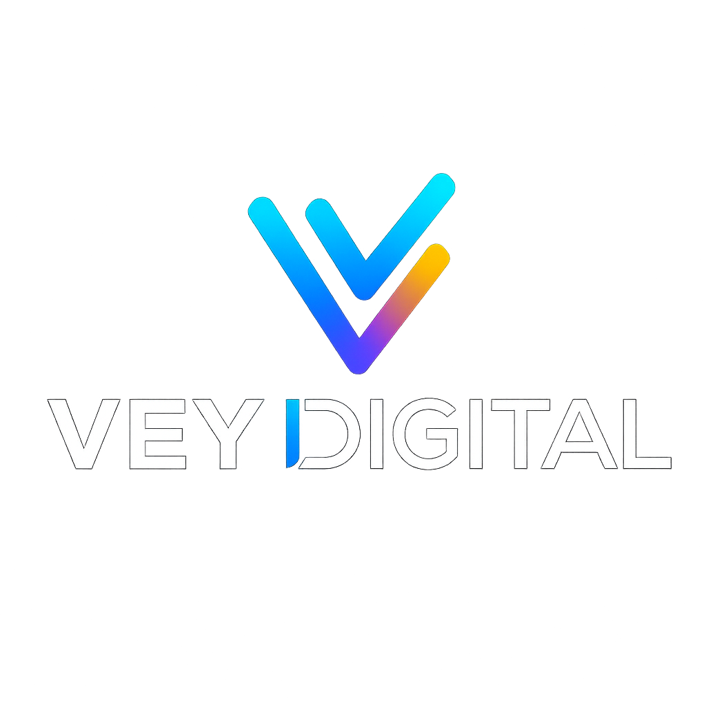

# Beta

  

Modern AI dashboards, workflow automation, and predictive analytics — helping organizations turn raw data into clear decisions with speed and accuracy.

---

## 🌐 Website
👉 [https://www.veydigital.com](https://www.veydigital.com)

---

## What We Do
- **Quick Insights Dashboard**: Track KPIs like sales, revenue, churn, and costs.  
- **AI Workflow Automation**: Cut manual processes in half with automated workflows.  
- **Predictive Analytics for Growth**: Forecast demand, churn, and customer lifetime value.  
- **VeyCare Subscription**: Ongoing optimization of dashboards and automation.

---

## How to Use This Repo
- `index.html` → Landing page  
- `work.html` → Portfolio / work showcase  
- `CNAME` → Domain mapping for GitHub Pages  
- `.nojekyll` → Required for serving static files correctly  

---

## Deployment
1. Push files to **main** branch.  
2. In **GitHub → Settings → Pages**, set source to `main` branch.  
3. Add custom domain → `www.veydigital.com`.  
4. Enforce **HTTPS** once certificate is ready.  

---

## Topics
`ai` · `analytics` · `automation` · `business-intelligence`

---

## Best Practices
- Keep repo organized with clear commit messages.  
- Update README when features evolve.  
- Use Issues/Projects tabs in GitHub to manage roadmap and client requests.  
- Protect the `main` branch with required reviews for professional credibility.  

---

## Contact
📧 Email: **info@veydigital.com**  
🌐 Website: [https://www.veydigital.com](https://www.veydigital.com)

---

## Brand

**Colors**
- Deep Tech Blue `#0D1B2A`  
- Electric Blue `#00AEEF`  
- Warm Yellow `#FFC857`  
- Ink `#E6EEF8`  
- Slate `#A9B8CC`  

**Typography**
- System sans (Arial/Helvetica)  
- Optional: Inter (400/600/800)  

**Assets**
- Favicon → `/favicon.png`  
- Social Preview → `/og-image.jpg`  
- Logo → `assets/img/textoutline.png`

---

## Repo Info
- `index.html` → Website root page  
- `work.html` → Work showcase page  
- `CNAME` → Domain mapping  
- `README.md` → Repo overview & documentation  
- `LICENSE` → Repository license information  

---

## License
This repository is licensed under the MIT License — see the LICENSE file for details.  

© VeyDigital
